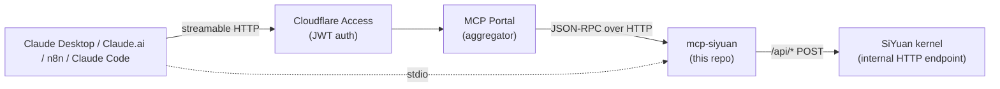

# mcp-siyuan

[Model Context Protocol](https://modelcontextprotocol.io) server for [SiYuan Notes](https://b3log.org/siyuan/), built on [FastMCP](https://github.com/jlowin/fastmcp) 3.x.

`mcp-siyuan` runs as a **sidecar** to the SiYuan kernel and exposes its HTTP API as MCP tools. It speaks two transports — **streamable HTTP** for remote clients (Claude Desktop, Claude.ai connectors, n8n) and **stdio** for local Claude Code — so the same image and code path serve both use cases.



The stdio path is used directly by local Claude Code; the HTTP path traverses an authenticated edge (e.g. Cloudflare Access) and an MCP portal aggregator.

---

## Tool Catalog

All tools are exposed under the `siyuan_` prefix at the portal (e.g., `siyuan_list_notebooks`). Internally they're registered as the bare name. Every write tool accepts an optional `idempotency_key` — see [Operator Runbook](#operator-runbook).

### Tier 1 — Read / Query

| Tool | Description |
|------|-------------|
| `siyuan_list_notebooks` | List all notebooks in the SiYuan workspace. |
| `siyuan_sql_query` | Execute a read-only SQL SELECT against SiYuan's internal database. |
| `siyuan_get_document` | Get a document's markdown content by its block ID. |
| `siyuan_search` | Quick full-text search across all SiYuan content (no surrounding context). |
| `siyuan_get_block` | Get a single block's content and metadata by ID. |
| `siyuan_get_block_attrs` | Get all attributes (system and custom) for a block. |

### Tier 2 — Write

| Tool | Description |
|------|-------------|
| `siyuan_create_notebook` | Create a new notebook in SiYuan. |
| `siyuan_rename_notebook` | Rename an existing notebook. |
| `siyuan_remove_notebook` | Remove a notebook and all its documents. |
| `siyuan_create_document` | Create a new document in a SiYuan notebook. Accepts `idempotency_key`. |
| `siyuan_update_block` | Update an existing block's content. Accepts `idempotency_key`. |
| `siyuan_insert_block` | Insert a new block relative to an anchor block. Accepts `idempotency_key`. |
| `siyuan_append_block` | Append content to the end of a document or container block. Accepts `idempotency_key`. |
| `siyuan_delete_block` | Delete a block by ID. |
| `siyuan_delete_doc` | Delete a document by its block ID (wraps `/api/filetree/removeDocByID`). Verifies the doc is actually gone via SQL — unlike `delete_block`, which silently no-ops on type='d' blocks. Accepts `idempotency_key`. |
| `siyuan_set_block_attrs` | Set attributes on a block. Accepts `idempotency_key`. |
| `siyuan_move_doc` | Move one or more documents to a new parent document or notebook. |
| `siyuan_rename_doc` | Rename a document without moving it. |
| `siyuan_move_block` | Move a block to a new position. |
| `siyuan_daily_note` | Create or open today's daily note in a notebook. |

### Smart — LLM-ergonomic high-level tools

| Tool | Description |
|------|-------------|
| `siyuan_get_recent_docs` | Get recently modified documents, newest first. |
| `siyuan_find_tasks` | Find task/TODO items across SiYuan notes. |
| `siyuan_get_backlinks` | Get all blocks that reference (link to) a given block or document. |
| `siyuan_get_tags` | List all tags used across the workspace with their usage count. |
| `siyuan_search_by_tag` | Find all blocks with a specific tag. |
| `siyuan_get_block_children` | Get a block and its child blocks as a tree structure. |
| `siyuan_search_with_context` | Search SiYuan and return results with surrounding context blocks. |
| `siyuan_capture_task` | Append a new task checkbox to today's daily note. |
| `siyuan_get_document_outline` | Get the heading outline of a document. |

### Export

| Tool | Description |
|------|-------------|
| `siyuan_export_pdf` | Export a SiYuan document as PDF (WeasyPrint; A3/A4/A5/Letter/Legal/Tabloid, portrait/landscape, image quality 1–100). Math blocks render as raw LaTeX since WeasyPrint does not execute JavaScript. |

**Example invocation** (Claude.ai or any MCP client):

```json
{
  "tool": "siyuan_create_document",
  "args": {
    "notebook": "20210817205410-2kvfpfn",
    "path": "/Inbox/2026-04-30 Quick note",
    "markdown": "# Hello\n\nFrom the API.",
    "idempotency_key": "inbox-2026-04-30-quick-note"
  }
}
```

The hand-written catalog is kept honest by `tests/test_readme_tool_catalog.py`, which fails CI if a registered tool isn't documented here.

---

## Transport Architecture

The MCP spec evolved through several wire formats; what we run in production is **streamable HTTP** (a.k.a. "Streamable HTTP transport") with **stateless** sessions, plus **stdio** for local subprocess clients. We deliberately do not use the older HTTP+SSE split:

- **stdio** — used by Claude Code launching `python -m mcp_siyuan` as a subprocess. No auth, no network — IPC over pipes. Set `TRANSPORT=stdio` (the default).
- **streamable HTTP** — used by Claude Desktop, Claude.ai connectors, and n8n. JSON-RPC over `POST /mcp` with optional server-streamed responses. Set `TRANSPORT=http`. Requires `MCP_API_KEY` (the server fails fast at startup without one).
- **HTTP+SSE (legacy)** — the original `/sse` + `/messages` split. We don't run it. The current MCP spec consolidated on streamable HTTP with chunked or SSE-style responses negotiated per request.

`stateless_http=True` is set on the streamable-HTTP server so Cloudflare-killed idle connections do not leave orphaned MCP sessions sitting in memory; every request is independently auth'd and dispatched. See `mcp_siyuan/server.py` for the runner.

For deeper FastMCP protocol detail, see the [FastMCP docs](https://gofastmcp.com/).

---

## FastMCP Usage Notes

This repo follows a small set of conventions worth knowing if you're contributing:

- **Tool registration is explicit** in `mcp_siyuan/server.py`: every tool function is wrapped by `traced_tool(...)` and then handed to `mcp.tool(...)`. The wrapper preserves `__name__` and `__doc__` so FastMCP can introspect the schema.
- **Auth uses a `TokenVerifier`** subclass (`mcp_siyuan/auth.py`). HMAC-compared static bearer (the `MCP_API_KEY`). Required in HTTP mode; the server refuses to start without it.
- **The `/health` endpoint** is registered with `@mcp.custom_route("/health", methods=["GET"])`. It probes the upstream SiYuan kernel with a 30-second cache (configurable via `UPSTREAM_PROBE_INTERVAL`). Pass `?diag=1` to also dump the recent-tool-call ring buffer (see Operator Runbook).
- **Error propagation**: tools raise normal exceptions (`SiYuanError`, `ValueError`, etc.). FastMCP catches and converts them to MCP error payloads. The `traced_tool` wrapper appends `[request_id=...]` to the error message so clients can correlate.
- **Async-first**: every tool function is `async def`. The kernel client (`mcp_siyuan/client.py`) wraps `httpx.AsyncClient`. A single module-level `sy = SiYuanClient()` singleton is reused across calls.

For the underlying framework's tool definition, transport, and middleware mechanics, defer to the FastMCP docs rather than re-documenting them here.

---

## Configuration

All configuration is via environment variables. `mcp_siyuan/config.py` parses them through `pydantic-settings`.

### Connection to SiYuan

| Variable | Default | Notes |
|----------|---------|-------|
| `SIYUAN_URL` | `http://siyuan:6806` | Kernel endpoint. Must be `http://` or `https://`. The default assumes the sidecar pattern with the SiYuan container reachable on the same Docker network. |
| `SIYUAN_TOKEN` | *(empty)* | API token from SiYuan settings. The server warns at startup if unset; calls will be unauthenticated. |
| `UPSTREAM_PROBE_INTERVAL` | `30` | Seconds the `/health` probe result is cached. |

### Server transport

| Variable | Default | Notes |
|----------|---------|-------|
| `TRANSPORT` | `stdio` | One of `stdio`, `http`. |
| `HOST` | `127.0.0.1` | Bind host (HTTP mode). Container deploys typically bind `0.0.0.0`. |
| `PORT` | `8000` | Bind port (HTTP mode). |
| `MCP_API_KEY` | *(empty)* | Bearer token. **Required** in HTTP mode; server refuses to start without it. Inject via your secret store / orchestrator variables in production. |

### Observability & reliability

| Variable | Default | Notes |
|----------|---------|-------|
| `SIYUAN_LOG_LEVEL` | `INFO` | Sets the root log level. JSON formatter emits `ts`, `level`, `request_id`, `tool_name`, `caller`, `args_size_bytes`, `kernel_status`, `latency_ms`, `outcome`, `message`. |
| `SIYUAN_DIAG_BUFFER_SIZE` | `50` | Number of recent tool-call records held in memory for `/health?diag=1`. |
| `SIYUAN_IDEMPOTENCY_TTL_SECONDS` | `300` | TTL for the in-process write-tool replay cache. |

### Where each is set

- **Production (HTTP)** sets `TRANSPORT=http`, `HOST=0.0.0.0`, `PORT=8000`, plus `MCP_API_KEY`, `SIYUAN_URL`, and `SIYUAN_TOKEN` from your secret store. See `compose.yaml` for the container shape.
- **Local Claude Code (stdio)** reads from your shell env or `.env`. Defaults are correct for the common case; you'll typically only need `SIYUAN_TOKEN`.
- **CI / tests** ignore most of these — tests mock the kernel client.

---

## Deployment

The image builds on every push to `main`. A container orchestrator picks up the new image and rolls it into the stack defined in `compose.yaml`. In our setup:

1. Push to `main`.
2. A git-push webhook triggers a `Dockerfile` build.
3. The new image replaces the running container.
4. A Cloudflare Tunnel + Access edge fronts the service; an MCP Portal aggregator routes the `/siyuan/*` namespace to this server.

To check status hit the `/health` endpoint behind your authenticated edge.

The Dockerfile installs Pango, Cairo, and Noto fonts for WeasyPrint. The production container runs with a tight memory limit (see `compose.yaml`).

**Single-replica constraint**: the server keeps the idempotency cache and diag ring buffer in process memory. Running multiple replicas would split those caches per pod and break the replay semantics that callers depend on. Don't horizontally scale this service without first migrating the cache to Redis (or similar shared store).

---

## Operator Runbook

### Symptom: `No approval received.`

A reproducible failure pattern we have seen across multiple MCP servers in our fleet:

- Several consecutive identical MCP tool calls return the literal error `No approval received.`
- A byte-identical retry — same args, same conversation, same MCP session — eventually succeeds.
- The same string appears on unrelated upstream servers, strongly suggesting the failure originates above the upstream servers in a shared layer (the MCP portal aggregator, the FastMCP framework, or the Claude client). It is **not** produced by this server's code.

**Manual workaround for any operator/agent now**:

1. Retry the call once with the same args.
2. If the retry succeeds, **never** commit destructive downstream operations (cancel tasks, delete notes, send messages) until a real success return value is received.
3. If the retry also fails, surface to the user — do not loop blindly.

For write tools, pass an `idempotency_key` so that an accidental client-side retry doesn't create duplicate documents/blocks. The cache is in-process with a default 5-minute TTL (`SIYUAN_IDEMPOTENCY_TTL_SECONDS`); failures are explicitly **not** cached, so a real retry can still produce a fresh kernel call.

### Diagnostic surface: `/health?diag=1`

Every tool invocation is assigned a UUIDv4 `request_id` and appended to an in-memory ring buffer (size `SIYUAN_DIAG_BUFFER_SIZE`, default 50). To pull recent activity:

```bash
curl -H "Authorization: Bearer $MCP_API_KEY" \
  "https://<your-mcp-host>/health?diag=1" | jq '.diag[-10:]'
```

Each entry contains `ts`, `request_id`, `caller`, `tool_name`, `args_size_bytes`, `kernel_status`, `latency_ms`, `outcome`, and `error`. The same `request_id` appears as `[request_id=…]` on any error message returned to the MCP client, and as the `request_id` field on every JSON log line in `docker logs`.

To filter container logs by request:

```bash
docker logs <mcp-siyuan-container> 2>&1 | jq -c 'select(.request_id == "abc-123-...")'
```

### Cross-system correlation

Once you have a `request_id` from a failure, the next investigation steps live outside this repo:

1. **Grep the portal/FastMCP source for `"No approval received"`** — the literal string. Likely candidates: the portal aggregator, the FastMCP framework, or the Claude client connector code.
2. **Pull edge auth logs** (e.g. Cloudflare Access) for the public hostname at the failure timestamps. Look for JWT denials/refreshes or 5xx responses from origin.
3. **Reproduce with `curl`** directly against the public hostname using the same bearer token Claude uses. If the failure pattern reproduces outside Claude → server/portal side. If not → Claude client involvement.
4. **Audit per-call approval gating** in the portal config and any Claude connector setting that might fire approval prompts in a way the call site doesn't expect.

### FastMCP version pin

`fastmcp` is pinned to `==3.2.4` in `pyproject.toml`. This is intentional while the No-approval-received root-cause investigation is open — a known-fixed framework version makes the upstream investigation tractable. The startup banner logs `fastmcp_version`; if it ever drifts from the pin, the server emits an `ERROR` log line but does not crash. Do not relax the pin without coordinating with the team.

---

## Local Development

Set up the venv and run the test suite:

```bash
uv sync
uv run pytest
```

### Run against a local SiYuan via stdio

```bash
export SIYUAN_URL=http://localhost:6806
export SIYUAN_TOKEN=your-siyuan-token
uv run python -m mcp_siyuan
```

In another terminal, configure Claude Code to launch this command as an MCP server.

### Run streamable HTTP behind a tunnel

```bash
export TRANSPORT=http
export HOST=127.0.0.1
export PORT=8000
export MCP_API_KEY=$(openssl rand -hex 32)
export SIYUAN_TOKEN=your-siyuan-token
uv run python -m mcp_siyuan
```

Then expose with `cloudflared tunnel --url http://127.0.0.1:8000` or `tailscale serve` for testing.

### Smoke tests

```bash
# Unit + integration tests (mocks SiYuan)
uv run pytest

# Single test module
uv run pytest tests/test_idempotency.py -v

# Verify README catalog stays in sync with registered tools
uv run pytest tests/test_readme_tool_catalog.py
```

---

## Versioning & Release

Two places need to agree on the version:

- `pyproject.toml`'s `[project] version`
- `mcp_siyuan/__init__.py`'s `__version__`

The release commit pattern (see commit `8f82d78`): bump both in a single `chore: sync __init__.__version__ with pyproject (X.Y.Z)` commit, followed by a `chore(release): vX.Y.Z [skip ci]` commit. The drift is enforced by humans, not CI.

`CHANGELOG.md` is updated alongside the release commit.

---

## Related work

Cross-references to upstream investigations (No-approval-received RCA, portal caching, server consolidation, portal auth) live in the team's internal tracker, not in this public README.
